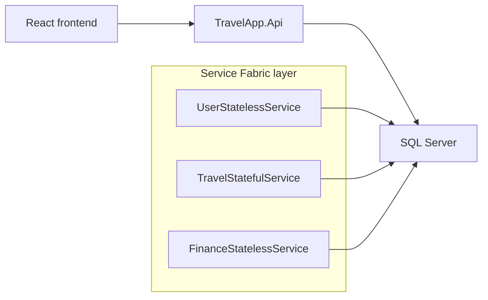

# System Architecture

## Overview

TravelApp is a full-stack travel planning system built with React, ASP.NET Core 8 Web API, Entity Framework Core, Microsoft SQL Server, and a Microsoft Service Fabric deployment layer.

## Frontend

The frontend is a React application created with Vite. It is organized around routed pages, shared components, API service modules, a model layer, and React Context for authentication and notifications.

- `src/pages` contains route-level views.
- `src/components` contains reusable UI sections.
- `src/api` contains all HTTP calls.
- `src/models` defines frontend domain model shapes.
- `src/context` contains global authentication and notification state.

API configuration is loaded from `VITE_API_BASE_URL` in `frontend/.env`.

## Backend

The backend follows a Controllers -> Services -> Repositories structure. DTOs are separated from EF Core entities, and service classes perform business validation and mapping.

### UserService

Located under `backend/TravelApp.Api/UserModule`.

Responsibilities:

- User registration and login
- Password hashing
- JWT creation
- Role handling
- Admin statistics endpoint

This module maps to the `UserStatelessService` Service Fabric boundary.

### TravelService

Located under `backend/TravelApp.Api/TravelModule`.

Responsibilities:

- Travel plan CRUD
- Destinations
- Activities
- Checklist items
- Share links and QR codes
- PDF report generation

This module maps to the `TravelStatefulService` Service Fabric boundary. SQL Server remains the main persistent store.

### FinanceService

Located under `backend/TravelApp.Api/FinanceModule`.

Responsibilities:

- Expense creation
- Expense deletion
- Expense category and amount validation
- Ownership checks through travel plan access

This module maps to the `FinanceStatelessService` Service Fabric boundary.

## Database

The system uses Microsoft SQL Server through EF Core. The default development database is SQL Server LocalDB. Migrations are stored in `backend/TravelApp.Api/Migrations`, and `Database.Migrate()` runs during backend startup to keep the database schema current.

Main relationships:

- `User` owns many `TravelPlan` records.
- `TravelPlan` owns destinations, activities, expenses, and checklist items.
- Dependent records are deleted through cascade delete when their parent plan is deleted.

## Service Fabric Layer

The repository includes a Service Fabric application package under `backend/ServiceFabric`:

- `ApplicationPackageRoot/ApplicationManifest.xml`
- `ApplicationPackageRoot/UserServicePkg/ServiceManifest.xml`
- `ApplicationPackageRoot/TravelServicePkg/ServiceManifest.xml`
- `ApplicationPackageRoot/FinanceServicePkg/ServiceManifest.xml`
- `src/UserStatelessService`
- `src/TravelStatefulService`
- `src/FinanceStatelessService`

The Service Fabric topology is:

`TravelApp.Api` exposes the HTTP routes used by the frontend. The Service Fabric package defines three service boundaries and includes both stateless and stateful services.
