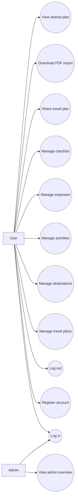

# Use Case Diagram

## Actors

- User
- Admin

## Use Cases

### User

- Register account
- Log in
- Log out
- Create travel plan
- View travel plans
- Update travel plan
- Delete travel plan
- Add destination
- Update destination
- Delete destination
- Add activity
- Update activity
- Delete activity
- Add expense
- Delete expense
- Add checklist item
- Mark checklist item as done
- Delete checklist item
- Generate share link
- Copy share link
- Download QR code
- Download PDF report
- Open read-only shared travel plan

### Admin

- Log in
- View admin overview
- View total user count
- View total travel plan count

## Mermaid Use Case Diagram

